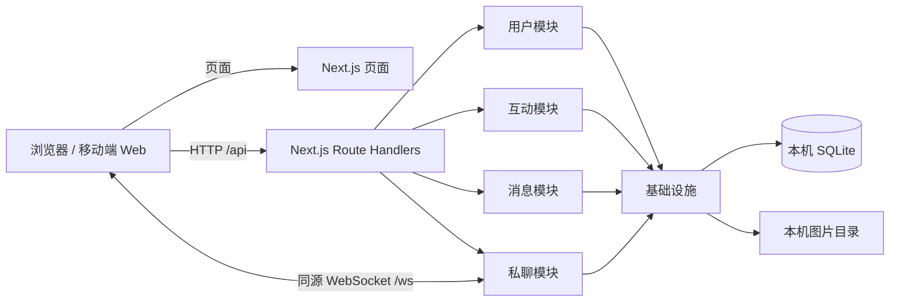
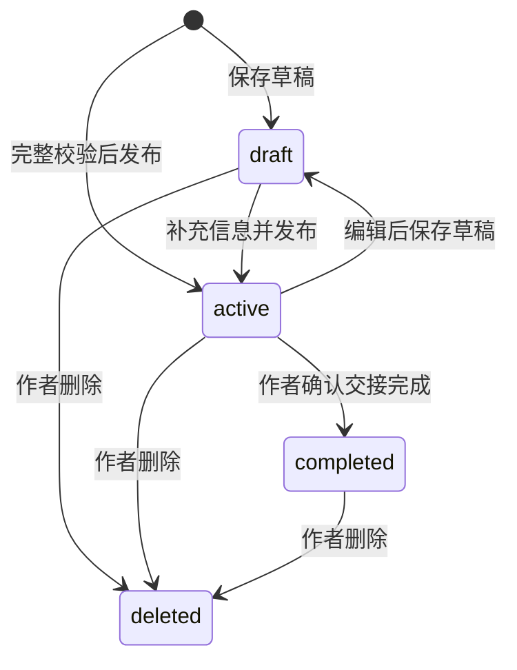

# 架构与模块边界

所有服务端部分由 `apps/web/server.ts` 启动，在同一个 Node 进程、同一个端口运行。Next.js 同时负责页面和 HTTP API；浏览器前端与后端通过接口保持职责分离。

## 五个模块

| 模块             | 主要职责                                                  | 依赖                                |
| ---------------- | --------------------------------------------------------- | ----------------------------------- |
| `user`           | 注册与登录，scrypt 密码校验，随机会话令牌，个人资料与退出 | 数据库、共享输入校验                |
| `interaction`    | 收藏幂等添加/删除，浏览计数、历史与统计                   | 消息可见性校验、数据库              |
| `private-chat`   | 双人会话、消息持久化、读取游标、未读计数、实时推送与重连  | 用户认证、消息可见性、数据库        |
| `message`        | 寻物/招领、搜索过滤、附近查询、草稿、状态、作者权限       | 数据库、共享输入校验                |
| `infrastructure` | 数据库连接与事务、版本迁移、上传、异常、请求上下文        | Node 本地能力、Web Request/Response |

模块位于 `apps/web/src/server/modules/`。`src/app/api/**/route.ts` 仅导出 HTTP 方法和运行时配置；各模块的 `handlers.ts` 负责参数解析、认证和返回，发布与私聊的业务操作位于 `service.ts`。基础设施中的 `http.ts` 统一处理 Web Request/Response、来源检查、频率和请求大小限制、异常格式。共享包提供 TypeScript 类型和 Zod schema，服务端最终校验输入，浏览器预校验用于提示用户。

数据模型与执行逻辑按以下文件边界组织：

- `packages/shared/src/models.ts`：前后端共享的数据结构，包括用户、发布信息、聊天消息、历史分页和统计；只声明类型，不依赖校验或业务实现。
- `packages/shared/src/schemas.ts`：输入解析、默认值和发布校验规则；发布校验的输出通过 `satisfies z.ZodType<PostInput>` 与共享模型保持类型兼容。
- `packages/shared/src/constants.ts`：类别标签与校园示例地点；`index.ts` 仅汇总导出，保留现有包入口。
- 服务端模块的 `models.ts`：数据库行、查询投影或基础设施上下文类型；`schemas.ts`：接口输入校验。`handlers.ts` 和 `service.ts` 导入这些定义处理请求和业务，不再内嵌模型声明。
- `apps/web/src/models/session.ts`：浏览器会话状态契约，与 Provider 的连接和状态更新逻辑分开。
- `infrastructure/schema.ts`：SQLite 建表和索引定义；`database.ts` 负责连接、迁移执行及事务，沿用原有版本号与表结构。

新增或调整模型时在对应模型文件中维护，使用 `import type` 引入；权限、状态变更、查询和持久化操作留在执行逻辑文件中。

`runtime.ts` 使用进程级单例连接 SQLite，并保存实时推送函数。自定义启动入口和 Next.js 编译后的 Route Handlers 通过同一个 `globalThis` Symbol 取得该实例；开发热更新不会创建重复连接，HTTP 保存后的消息能推送到自定义服务入口管理的 WebSocket。数据库结构和文件路径沿用重构前的版本。

Next.js Route Handlers 处理所有普通 HTTP 接口。WebSocket 需要 Node HTTP 的 upgrade 事件，因此使用轻量的自定义服务入口挂载 `ws`，并保留 Next.js 自己的开发热更新连接。这是同一个 Next.js 应用，不需要独立 API 进程。启动入口用 TypeScript 单独编译；源代码的 `.ts` 相对导入在输出时改写为 `.js`，兼容 Turbopack 和 Node ESM。此项目不使用 Next.js standalone 输出或无状态 Serverless 部署。

## 数据模型

SQLite 包含 users、sessions、posts、uploads、favorites、history、conversations、chat_messages、conversation_reads 和 schema_migrations。

- 会话数据库只保存令牌的 SHA-256 摘要，浏览器使用 HttpOnly、SameSite=Lax Cookie。令牌使用加密随机数，默认七天失效。
- 密码使用随机盐和 scrypt；API 从不返回密码哈希。
- posts 保存作者、类型、类别、时间地点、描述、联系方式、图片路径、可选坐标、状态和时间戳。
- 收藏和历史使用 `(user_id, post_id)` 唯一键，重复收藏无副作用，重复浏览更新时间但不生成重复历史项。
- 相同信息、相同两位用户复用会话。双方 ID 排序后建立唯一键，禁止与自己聊天。
- chat_messages 使用 `(sender_id, client_id)` 唯一键，网络重试不会重复发送。读取与分页使用 SQLite rowid 游标，避免相同时间戳漏消息。
- 文件名由服务端随机生成，限制 PNG/JPEG/WebP、5 MB、最多九张，检查文件头和图片归属。文件存储和数据库登记失败时回滚文件写入。

数据库迁移在启动时按版本执行。所有 SQL 参数绑定；排序和动态表名来自服务端固定枚举。信息删除使用 deleted_at，公开列表、收藏和历史隐藏该信息，已经建立的会话保留记录。

## 发布状态

公开信息必须填写名称、地点、发生时间和描述，时间不能在未来。草稿允许资料不完整，只对作者可见。completed 不再允许编辑或新建联系，公开详情和已有聊天保留，确保交接记录可回访。

## 实时私聊

客户端通过带会话 Cookie 的 `/ws` 连接接收消息。服务端验证登录状态和 Origin，按用户维护本进程的连接集合，最多五条同时连接。HTTP `POST /api/chats/:id/messages` 验证会话成员并保存消息，提交后通过 WebSocket 向双方推送。

数据库消息历史是事实来源；客户端断线指数退避重连，连上后重新拉取历史，断线期间每五秒 HTTP 同步。消息发送用 clientId 去重；已读保存到当前最后一条消息的 rowid，后台页面不自动标记新消息已读。连接每三十秒检查心跳和会话有效期，退出登录立即撤销当前会话连接。

单机部署只运行一个 Next.js 服务实例。同步 SQLite API 和内存连接集合适合当前部署要求；本项目不引入多实例消息广播、分布式会话或集群协调。

## 原型实现范围

390 px 为设计宽度，桌面居中展示移动布局，小屏按宽度适配。原型中的固定数量改为数据库统计，固定日期改为实际时间，会话在线文字改为真实连接状态。页面具备加载、空数据、请求失败、校验失败、未登录和重复提交反馈。

校园地图和预置地点坐标属于示意数据；用户和发布信息通过注册、发布流程创建。真实地点校正、地图服务接入、校园官方通知、找回身份核验不由现有原型自动提供。

框架行为参考 [Next.js Route Handlers](https://nextjs.org/docs/app/getting-started/route-handlers)、[Next.js 自定义服务](https://nextjs.org/docs/app/guides/custom-server) 与 [Node SQLite](https://nodejs.org/docs/latest-v22.x/api/sqlite.html)。
