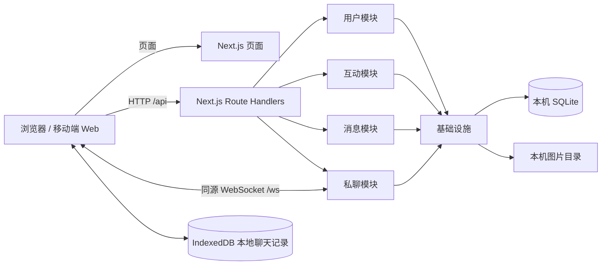
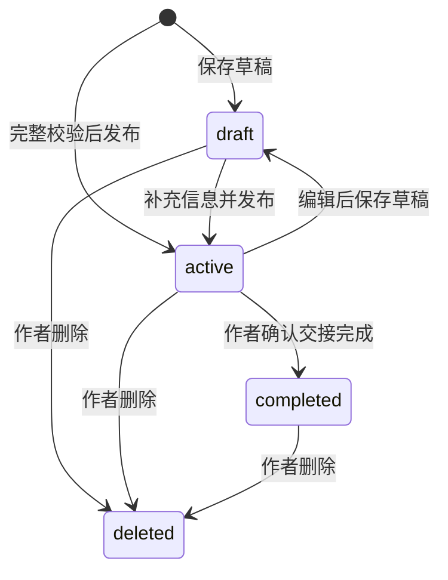

# 架构与模块边界



所有服务端部分由 `apps/web/server.ts` 启动，在同一个 Node 进程、同一个端口运行。Next.js 同时负责页面和 HTTP API；浏览器前端与后端通过接口保持职责分离。

## 五个模块

| 模块             | 主要职责                                                  | 依赖                                |
| ---------------- | --------------------------------------------------------- | ----------------------------------- |
| `user`           | 注册与登录，scrypt 密码校验，随机会话令牌，个人资料与退出 | 数据库、共享输入校验                |
| `interaction`    | 收藏幂等添加/删除，浏览计数、历史与统计                   | 消息可见性校验、数据库              |
| `private-chat`   | 双人会话、TTL 投递存储、设备 ACK、未读、重试及对账        | 用户认证、消息可见性、数据库        |
| `message`        | 寻物/招领、搜索过滤、附近查询、草稿、状态、作者权限       | 数据库、共享输入校验                |
| `infrastructure` | 数据库连接与事务、版本迁移、上传、异常、请求上下文        | Node 本地能力、Web Request/Response |

模块位于 `apps/web/src/modules/`。`src/app/api/**/route.ts` 仅导出 HTTP 方法和运行时配置；各模块的 `handlers.ts` 负责参数解析、认证和返回，发布与私聊的业务操作位于 `service.ts`。基础设施中的 `http.ts` 统一处理 Web Request/Response、来源检查、频率和请求大小限制、异常格式。每个模块提供自己的数据类型和 Zod 校验，页面按模块直接导入；服务端最终校验输入，浏览器预校验用于提示用户。

数据模型和业务逻辑放在同一模块文件夹下，按文件职责分离：

```text
apps/web/src/modules/
  message/
    models.ts       发布信息的数据类型
    schema.ts       Drizzle 发布信息表模型
    schemas.ts      发布和查询校验
    constants.ts    类别与校园地点
    repository.ts   数据库读写
    service.ts      作者权限、发布状态等业务规则
    handlers.ts     HTTP 请求处理
  user/             同样组织用户模型、表定义、校验和业务逻辑
  interaction/      同样组织收藏、历史与统计
  private-chat/     同样组织私聊，并包含 store.ts 本地存储、sync.ts 同步逻辑
  infrastructure/   数据库连接、迁移、上传和通用请求处理
```

`models.ts` 只声明类型，通过 `import type` 使用；`schema.ts` 定义本模块的数据库表；`schemas.ts` 执行输入校验。前端按所属模块导入模型和校验，不经过独立共享包，也不导入服务端数据库实现。`private-chat/models.ts` 包含消息、会话与本地消息状态；`user/models.ts` 包含用户及会话上下文类型。

基础设施只定义上传记录和迁移记录等通用表。`database.ts` 汇集各模块的表模型建立 Drizzle 实例；`migrations/` 保留已应用的版本化迁移。业务表不集中堆放到基础设施中。权限与状态规则留在业务层；查询、写入及数据库事务留在同目录的仓储文件中。

数据库读写使用 Drizzle ORM 0.45.3 的 `better-sqlite3` 驱动。仓储使用类型化的 `select`、`insert`、`update`、`delete`、条件表达式和冲突处理；Drizzle 自动映射数据库下划线字段和 TypeScript 驼峰字段，并转换图片 JSON。`rowid`、`instr`、聚合与条件表达式通过 Drizzle 的参数化 `sql` 模板补充，不直接调用驱动执行业务 SQL。消息写入、序号上界与会话更新时间、浏览次数与历史记录、已读批量更新使用 Drizzle 的同步事务，保持 `BEGIN IMMEDIATE` 语义。连接参数和版本化建表 DDL 是仅有的驱动层操作。

普通读写示例（仓储文件内）：

```ts
const user = db.orm.select().from(users).where(eq(users.email, email)).get();
db.orm.update(users).set({ name, bio }).where(eq(users.id, id)).run();
```

后续表结构变更需同时更新 Drizzle schema 并新增版本迁移，不修改已经应用的 v1 SQL；当前不使用自动 schema 同步或 `drizzle-kit push`。接入方式参考 [Drizzle SQLite 文档](https://orm.drizzle.team/docs/sqlite/get-started-sqlite) 和 [事务文档](https://orm.drizzle.team/docs/transactions)。

`runtime.ts` 使用进程级单例连接 SQLite，并保存实时推送函数。自定义启动入口和 Next.js 编译后的 Route Handlers 通过同一个 `globalThis` Symbol 取得该实例；开发热更新不会创建重复连接，HTTP 保存后的消息能推送到自定义服务入口管理的 WebSocket。数据库结构和文件路径沿用重构前的版本。

Next.js Route Handlers 处理所有普通 HTTP 接口。WebSocket 需要 Node HTTP 的 upgrade 事件，因此使用轻量的自定义服务入口挂载 `ws`，并保留 Next.js 自己的开发热更新连接。这是同一个 Next.js 应用，不需要独立 API 进程。启动入口用 TypeScript 单独编译；源代码的 `.ts` 相对导入在输出时改写为 `.js`，兼容 Turbopack 和 Node ESM。此项目不使用 Next.js standalone 输出或无状态 Serverless 部署。

## 数据模型

SQLite 包含 users、sessions、posts、uploads、favorites、history、conversations、chat_messages、chat_sequences、chat_receipts、chat_reads 和 schema_migrations。旧 conversation_reads 表仅用于 v1 迁移兼容。

- 会话数据库只保存令牌的 SHA-256 摘要，浏览器使用 HttpOnly、SameSite=Lax Cookie。令牌使用加密随机数，默认七天失效。
- 密码使用随机盐和 scrypt；API 从不返回密码哈希。
- posts 保存作者、类型、类别、时间地点、描述、联系方式、图片路径、可选坐标、状态和时间戳。
- 收藏和历史使用 `(user_id, post_id)` 唯一键，重复收藏无副作用，重复浏览更新时间但不生成重复历史项。
- 相同信息、相同两位用户复用会话。双方 ID 排序后建立唯一键，禁止与自己聊天。
- chat_messages 使用 `(conversation_id, sender_id, device_id, seq_id)` 唯一键，TTL 默认 7 天。chat_receipts 按消息、用户、设备记录接收确认，chat_reads 按实际消息 ID 记录已读。chat_sequences 只保留会话/发送设备的序号上界，阻止过期重试复活正文。
- 文件名由服务端随机生成，限制 PNG/JPEG/WebP、5 MB、最多九张，检查文件头和图片归属。文件存储和数据库登记失败时回滚文件写入。

数据库迁移在启动时按版本执行。查询参数由 ORM 绑定；排序和表选择来自服务端固定枚举。信息删除使用 deleted_at，公开列表、收藏和历史隐藏该信息，已经建立的会话保留记录。

## 发布状态



公开信息必须填写名称、地点、发生时间和描述，时间不能在未来。草稿允许资料不完整，只对作者可见。completed 不再允许编辑或新建联系，公开详情和已有聊天保留，确保交接记录可回访。

## 实时私聊与本地记录

浏览器账号各自使用独立的 IndexedDB 数据库，保存设备 UUID、各会话递增序号、消息、发送队列和会话摘要。分配 seqId 和写入待发送消息使用同一个读写事务，多标签页通过 BroadcastChannel 通知和 IndexedDB 发送租约协同；请求超时前租约仍有效，刷新后继续原消息标识的重试。客户端使用 getRandomValues 生成设备标识，兼容局域网 HTTP。

前端发消息先写本地，再通过 HTTP 提交。服务端在事务中检查四元组幂等键和序号上界、保存消息、更新会话时间。重试返回原消息。消息推送直接合并进本地数据库，本地提交成功后才 ACK，不再每收到一条推送就重新拉取最新历史页。页面从本地按 50 条分页读取，刷新及服务端 TTL 清理不会覆盖或截断本地历史。

服务端 Map 的 key 为用户 ID，value 为多个连接组成的 Set，每条连接包含 WebSocket、登录会话摘要、接收设备 ID 和重试时间。每秒检查该设备仍未确认的 TTL 内消息，退避重投；按设备的 ACK 保存在 SQLite 中，服务重启后仍可恢复积压。断线暂停连接推送，重新登录后继续；HTTP 每批 50 条的未确认拉取为备用通道，积压总量不受 50 条限制。

客户端不使用累计同步游标。最近 50 条对账返回服务端实际存在的消息 ID，客户端检查本地缺失项并批量补拉；它是补漏机制，主要交付由服务端逐条确认及重试保证。账号切换时终止同步任务，HTTP 请求同时检查本地账号标识与 Cookie 身份是否一致。

接收确认与已读分开：ACK 表示本地持久化完成；聊天页可见时，仅将实际展示的消息标记为已读。普通已读接口不会把刚到达但未显示的消息一起读掉。会话列表摘要及未读数量来自本地消息库，过期历史仍可在当前浏览器查看。

`CHAT_TTL_DAYS` 默认 7。服务器启动时及每分钟删除到期消息正文、接收确认和已读记录，查询立即过滤到期记录。会话关联信息和无正文的序号上界保留。服务端仅提供短期交付存储，不承诺恢复过期消息；清除浏览器站点数据后，旧记录不能从服务端恢复。

v2 迁移添加投递字段、四元组索引、ACK/已读/序号表，保留旧表的 rowid 和消息 ID。旧消息使用 legacy 设备标识及原 rowid 序号，按原创建时间加 7 天计算有效期；旧已读位置迁移为逐条已读记录。v1 建表 SQL 不修改。升级后需刷新旧客户端，API 发送字段已从 clientId 改为 deviceId、seqId、queuedAt。

生产仍为一个 Next.js 服务实例，使用同步 SQLite 驱动和进程内连接集合，不引入多实例广播。完整字段及重试规则见 [API 说明](api.md)。

## 原型实现范围

390 px 为设计宽度，桌面居中展示移动布局，小屏按宽度适配。原型中的固定数量改为数据库统计，固定日期改为实际时间，会话在线文字改为真实连接状态。页面具备加载、空数据、请求失败、校验失败、未登录和重复提交反馈。

校园地图和预置地点坐标属于示意数据；用户和发布信息通过注册、发布流程创建。真实地点校正、地图服务接入、校园官方通知、找回身份核验不由现有原型自动提供。

框架行为参考 [Next.js Route Handlers](https://nextjs.org/docs/app/getting-started/route-handlers)、[Next.js 自定义服务](https://nextjs.org/docs/app/guides/custom-server) 与 [Node SQLite](https://nodejs.org/docs/latest-v22.x/api/sqlite.html)。
